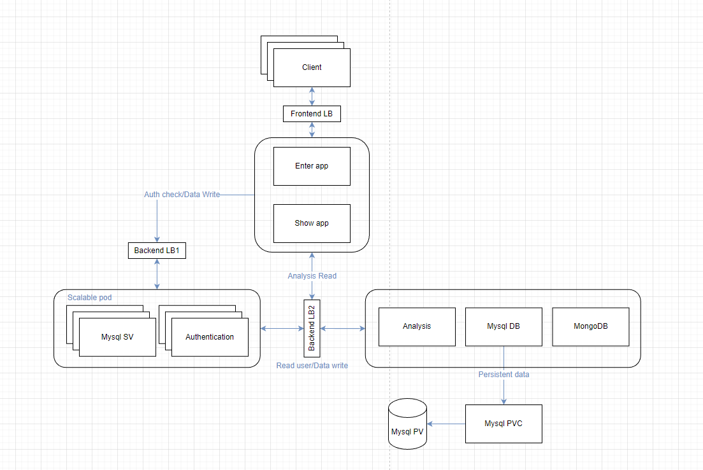

# Student Grade System

This project was designed and developed based on a microservices system. It's similar to my farm project, but I simplified the structure and focused on deploying it via K8S and the cloud side. The database and authentication system will be auto-scaled based on the load balancer metrics. All the data will be permanently stored via a persistent volume. I also used a bash script to simplify the entire deployment process.

# Structure View
